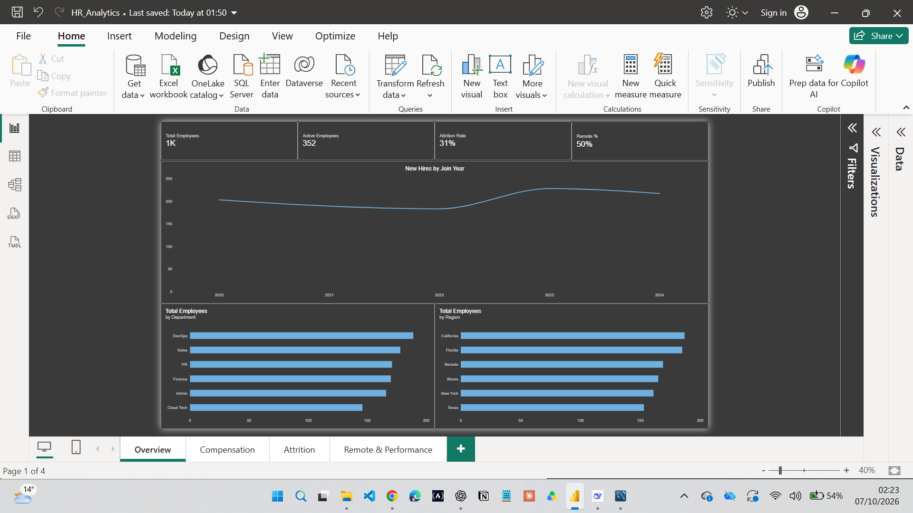
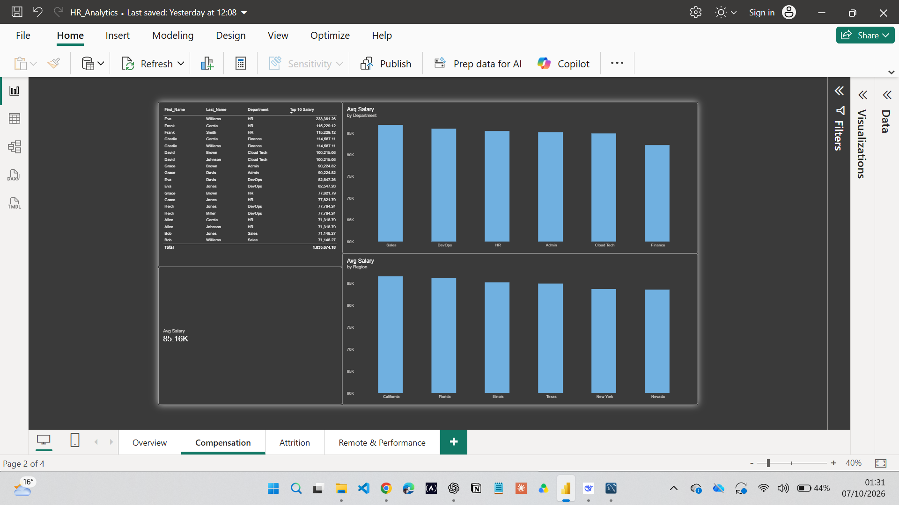
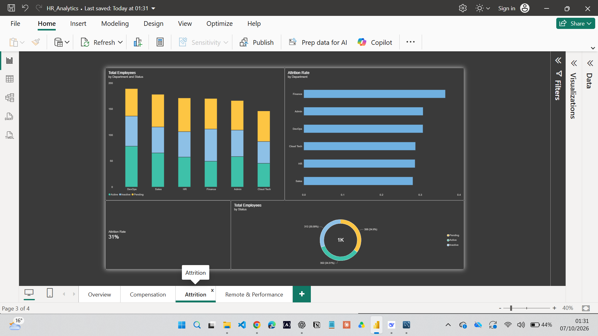

# HR Analytics Dashboard — Python + SQL + Power BI

An end-to-end HR analytics project: cleaning a messy 1,020-row employee dataset with Python, loading it into SQL, and building a 4-page interactive Power BI dashboard that answers real HR business questions.

**Built with:** Python (pandas) · SQL · Power BI (DAX) · Git

---

## 📸 Dashboard Preview

### Page 1 — Overview

*Headcount KPIs, hiring trend over time, and headcount by department and region.*

### Page 2 — Compensation

*Average salary by department and region, plus the top 10 earners.*

### Page 3 — Attrition

*Overall attrition rate, attrition by department, and a stacked breakdown of Active / Inactive / Pending by department.*

### Page 4 — Remote & Performance

*Remote work split, performance distribution, and a matrix of performance score vs. remote status.*

---

## 🎯 Business Questions Answered

1. How many employees does the company have, and how has headcount grown?
2. Which departments and regions carry the largest headcount?
3. Where is attrition concentrated, and how severe is it?
4. Is compensation consistent across departments and regions?
5. Does remote work affect performance?

---

## 🧰 Tech Stack

| Layer | Tool | Purpose |
|---|---|---|
| Data cleaning | Python (pandas) | Standardize, validate, impute, and re-export the raw CSV |
| Database | SQL (SQLite) | Analytical queries for KPI validation |
| Visualization | Power BI Desktop | DAX measures, 4-page interactive dashboard |
| Version control | Git / GitHub | Reproducible pipeline |

---

## 📁 Repository Structure

```text
corporate-employee-pipeline/
├── README.md
├── insights.md
├── data/
│   ├── raw/
│   │   └── Messy_Employee_dataset.csv
│   └── cleaned/
│       └── employees_clean.csv
├── python/
│   └── clean_employees.py
├── powerbi/
│   ├── HR_Analytics_PowerBI.pbix
│   ├── HR_Analytics_PowerBI.pdf
│   └── screenshots/
│       ├── overview.png
│       ├── compensation.png
│       ├── attrition.png
│       └── remote_performance.png
